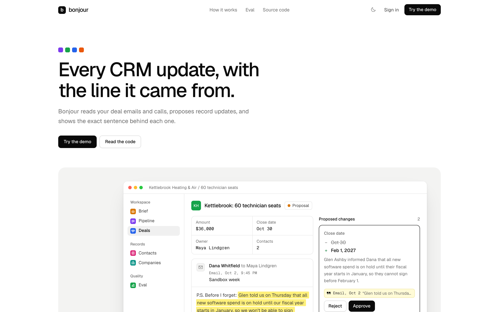
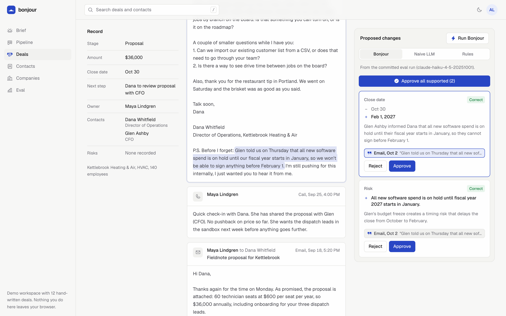
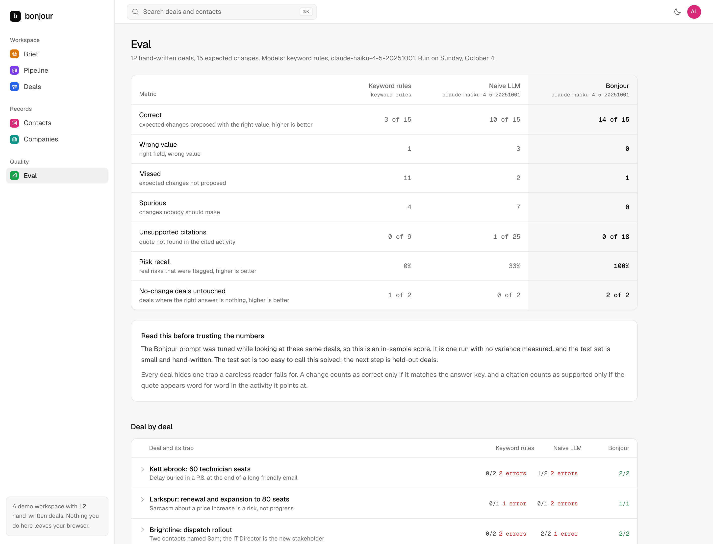
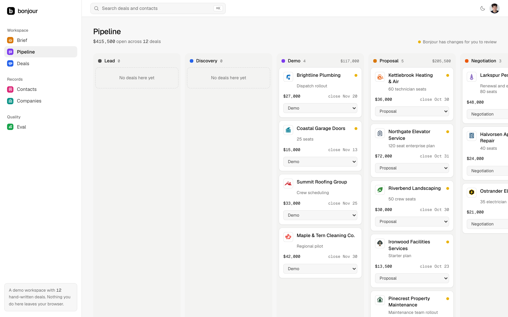
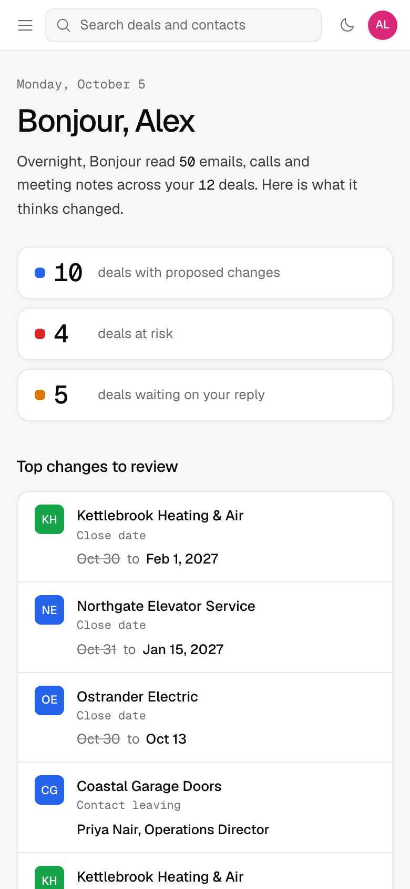
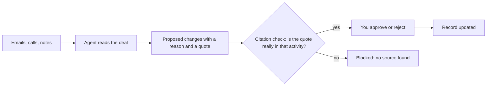

# Bonjour

A CRM that reads your deal emails and calls, proposes record updates, and shows the line every change came from.



## The problem

CRMs with an agent inside will happily update your deals for you. But when the close date moves or a risk appears, you can't see why, so you either check everything by hand or stop trusting the record. An update you can't trace back to a sentence someone actually wrote isn't worth much.

## What it does

Bonjour reads every email, call note and meeting note on a deal and proposes changes to the record: stage, amount, close date, next step, contacts joining or leaving, and risks. Every proposed change carries a reason and a quote. Before you see it, a citation check makes sure that quote appears word for word in the activity it points at. If it doesn't, the change is struck through and can't be approved.

You stay in charge. Click the quote chip and the exact span lights up inside the email. Approve or reject each change, or approve everything that has a source.

| Deal page, the cited line highlighted | Eval |
|---|---|
|  |  |

| Pipeline | Phone |
|---|---|
|  |  |

## How it works



The agent is one structured-output call per deal (`lib/agent.ts`). It gets the record, the activities oldest first, today's date and a small calendar, plus rules for the usual traps: forwarded history, out of office replies, hypotheticals, sarcasm, the P.S. The citation check is plain code (`lib/verify.ts`), not another model call.

## Quickstart

```bash
npm install
cp .env.example .env   # add your API key to run the agent live
npm run dev
```

Open http://localhost:3000 and sign in with the demo account:

- Email: `demo@bonjour.dev`
- Password: `bonjour`

The demo login is cosmetic. It keeps casual visitors on the landing page, nothing more.

You don't need a key to try it. Deal pages show the committed output from the last eval run (`results/runs.json`). "Run Bonjour" on a deal page calls the agent live, which needs a key.

Other scripts:

```bash
npm test        # scoring, citation check and fixture tests
npm run eval    # rerun all three recommenders and rewrite results/
npm run mcp     # start the MCP server on stdio
```

## Environment

| Variable | Needed for | Notes |
|---|---|---|
| `ANTHROPIC_API_KEY` | Live runs, `npm run eval`, the MCP `propose_updates` tool | Without it the app still works on committed results. |
| `BONJOUR_MODEL` | Optional | Defaults to `claude-haiku-4-5-20251001`. |
| `ANTHROPIC_WORKSPACE_ID` | Optional | Only for an org-wide key not scoped to a workspace. |
| `DEMO_ACCESS_TOKEN` | Live runs anywhere other than `next dev` | Runs cost money, so a deployment refuses them unless the request sends this value in the `x-demo-token` header. The deal page asks for it when needed. |

## Eval

Twelve hand-written deals, each hiding one trap (a delay buried in a P.S., a champion leaving, a hypothetical seat count next to the confirmed one, sarcasm, two people named Sam, and so on). Two of them should not change at all. Each recommender's proposals are scored against an answer key in `data/labels.json`. Model: `claude-haiku-4-5-20251001`, run on 2026-10-04.

| | Keyword rules | Naive LLM | Bonjour |
|---|---:|---:|---:|
| Correct | 3 of 15 | 10 of 15 | 14 of 15 |
| Wrong value | 1 | 3 | 0 |
| Missed | 11 | 2 | 1 |
| Spurious (changes nobody should make) | 4 | 7 | 0 |
| Unsupported citations | 0 of 9 | 1 of 25 | 0 of 18 |
| Risk recall | 0% | 33% | 100% |
| No-change deals left untouched | 1 of 2 | 0 of 2 | 2 of 2 |

The naive LLM gets the same model and the same output shape, with a one-line prompt, the activities in a scrambled order, and no request to cite anything.

Please read these numbers with the caveats:

- The Bonjour prompt was tuned while looking at these same 12 deals, so this is an in-sample score.
- It is one run. Variance between runs was not measured.
- The test set is small and hand-written. The test set is too easy to call this solved; the next step is held-out deals.

## MCP

The same agent runs behind an MCP server with three tools: `list_deals`, `get_deal` and `propose_updates`. Add it to any MCP client:

```json
{
  "mcpServers": {
    "bonjour": {
      "command": "npm",
      "args": ["run", "--silent", "--prefix", "/path/to/bonjour", "mcp"]
    }
  }
}
```

## What I'd build next

- Real inbox and calendar sync, so activities arrive on their own instead of from fixtures.
- Per-field confidence, so a shaky date change looks different from a confirmed seat count.
- A team review queue: changes routed to the deal owner, with who approved what and when.
- More test deals, and a held-out set the prompt has never seen.

## Project layout

- `app/` pages and the run API (`app/api/deals/[id]/run`)
- `components/` the UI
- `lib/` data model, agent, rules baseline, citation check, scoring
- `data/` fixtures and the answer key
- `results/` committed eval output
- `mcp/` the MCP server

## License

MIT, see [LICENSE](LICENSE).
